The long-term goal in this field is a **virtual cell**: a model of a cell good
enough that you can ask it questions and believe the answers. Not a lookup table
of experiments already done — a representation of how the thing actually works.

That is easy to say and hard to test. The
[Virtual Cell Challenge](https://arcinstitute.org/virtual-cell-initiative), run
annually by the Arc Institute, turns it into something measurable by
**perturbing** the cell: switch off one gene, and see whether the model
anticipated what the rest of the cell would do. The
[framing paper](https://doi.org/10.1016/j.cell.2025.06.008) calls it a Turing
test for the virtual cell, and the analogy is apt — the perturbation is
not the object of interest, it is the interrogation. A model that has genuinely
captured how a cell is wired should be able to answer. One that has memorised
outcomes should not.

I have been working on the 2026 edition. This post is an introduction to the
problem for people who can code but have never touched a pipette, and for
biologists who want to know why this is a hard modelling problem rather than a
data-cleaning exercise. I define every term as it comes up, every number and
figure is measured from the actual challenge data, and I am candid at the end
about the sense in which my own approach is not a cell model at all — which is
exactly why it plateaus.

## What we are trying to model

Start with the thing that surprises most people coming from software: **every
cell in your body contains the same genome.** A liver cell and a neuron carry
identical DNA. What differs is which genes each one is *using*.

A gene is a stretch of DNA that gets copied into RNA, and that RNA is usually
then translated into a protein that does something. **Gene expression** is how
much RNA a cell is currently making from a given gene — think of it as the volume
knob on that gene. The full set of RNA in a cell is its **transcriptome**.

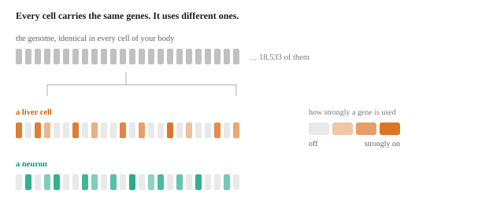
*Same parts list; a different subset switched on, at different volumes. That pattern *is* the cell type, and it is what sequencing measures.*

So a cell type is not a different parts list. It is a different *configuration*
of the same parts list. The genome is the code; expression is the running
process. When you hear "cell context" in this field, that is what it means: which
genes are on, and how loudly.

## Reading a cell, one molecule at a time

**Single-cell RNA sequencing** measures that configuration one cell at a time.
You capture thousands of individual cells, attach a molecular barcode unique to
each one, sequence everything together, then use the barcodes to sort the reads
back into per-cell profiles.

What you get is a table.

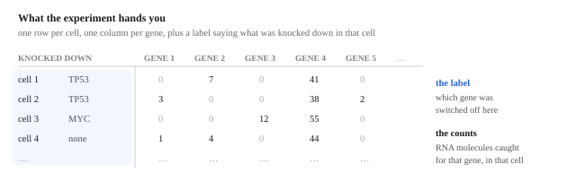
*A knockdown does not change one number — it shifts the whole row slightly, visible only by comparing hundreds of cells that got it against hundreds that did not.*

Rows are cells, columns are genes, and each entry counts how many RNA molecules
of that gene were caught in that cell. About **69% of that table is zero**.

Here is the part that trips up everyone modelling this data for the first time.
**A zero does not mean the gene is off.** Sequencing catches only a sample of the
molecules present, so a gene that is genuinely active can easily produce no reads
at all in a given cell. This is called **dropout** — though the zeros are
[consistent with ordinary molecule sampling](https://doi.org/10.1038/s41587-019-0379-5)
rather than some extra defect of the assay — and it is not a rare edge case:

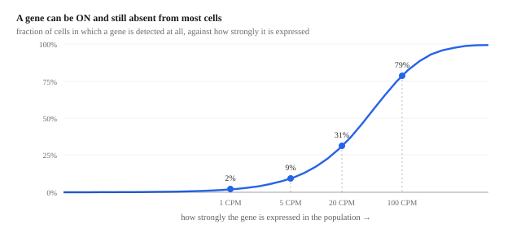
*This is *dropout*: a zero in the matrix often means "missed", not "off". It is why single cells have to be pooled before anything is claimed.*

A gene expressed at 5 counts per million — a real, functioning level — is detected
in under **10%** of cells. Even at 20 CPM it appears in about a third. Only well
above 100 CPM do you see it in most cells.

The consequence shapes everything downstream: **you cannot say much about any
individual cell.** Statements only become reliable when you pool hundreds of
cells that share a condition. That is why every method here works on
*populations*, and why, as we will see, submitting a single "best guess" cell
profile is catastrophically wrong. It is not just convention: benchmarks of
single-cell differential expression find that the methods that
[hold up against ground truth](https://doi.org/10.1038/s41467-021-25960-2) are
precisely the ones that aggregate cells before testing.

## Switching a gene off, as a question

To find out whether you understand a system, poke it and see if you predicted the
response. In a cell, the cleanest poke available is to switch off one gene and
watch what the rest of the cell does.

**CRISPR** is the tool. Its familiar form uses a protein called Cas9 which is
guided to a chosen spot in the genome by a short **guide RNA** — a piece of RNA
whose sequence matches the target — where it cuts the DNA. The variant used here
is **CRISPRi**, for [CRISPR interference](https://doi.org/10.1016/j.cell.2013.02.022).
It uses a Cas9 that has been deliberately broken so it can no longer cut. It just
parks on the gene's control region and blocks the machinery that reads it — and
[fusing a repressor domain to that dead Cas9](https://doi.org/10.1016/j.cell.2014.09.029)
makes the silencing strong and specific enough to run at genome scale.

The gene is not destroyed, it is turned down — typically to 10–30% of normal.
That is a **knockdown** rather than a knockout, and it is closer to real biology,
where genes are usually dialled rather than deleted.

Now combine the two ideas. Put a *different* guide RNA into each cell in a large
pool, so every cell has a different gene knocked down, then sequence all of them
at once. Each cell reports both which gene was targeted in it and what happened
to the other 18,000 genes. That is **Perturb-seq** — introduced by
[Dixit et al.](https://doi.org/10.1016/j.cell.2016.11.038) and
[Adamson et al.](https://doi.org/10.1016/j.cell.2016.11.048) in 2016 — and one
experiment can survey hundreds of genes.

Two words you will keep meeting: a **perturbation** is one gene knocked down, and
a **context** is a particular kind of cell. The whole difficulty lives in the
interaction between them — the same perturbation in a different context is a
different experiment, and a model that has genuinely captured the cell should
know why.

## What the challenge asks

The [2025 edition](https://arcinstitute.org/virtual-cell-initiative), the first,
released roughly 300,000 H1 human embryonic stem cells carrying 300 genetic
perturbations, split into fine-tuning, validation and test segments. Over 5,000
people registered from 114 countries, more than 1,200 teams submitted, and over
300 made final submissions, competing for a $100,000 grand prize sponsored by
NVIDIA, 10x Genomics and Ultima Genomics. The accompanying paper, *"[Virtual Cell
Challenge: Toward a Turing test for the virtual
cell](https://doi.org/10.1016/j.cell.2025.06.008)"*, appeared in *Cell* in 2025.

The structural detail that matters: in 2025 you saw the target cell type
perturbed. You had H1 stem cells with many perturbations measured, and predicted
*different* perturbations in *that same cell type*. A model could learn what
responses look like in H1 specifically and fill in gaps — **interpolation**.

[2026](https://doi.org/10.1016/j.cell.2026.08.004) removes that.

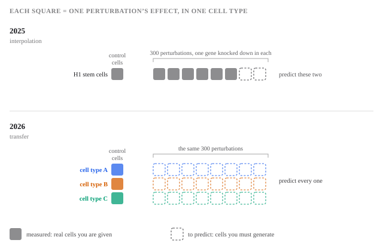
*In 2025 the model saw one cell type responding and filled the gaps. In 2026 nothing about how the scored cell types respond can be learned before predicting them.*

There is no training set. You must predict knockdown responses in cell types you
have never seen perturbed, given only those cells sitting there unperturbed and a
list of genes to knock down. This is **zero-shot** prediction, and it demands
something categorically different: whatever the model knows about perturbations
has to come from *other* cell types and still apply here.

This is the design decision that turns the competition into a test of modelling
rather than recall. If you have seen a cell type perturbed, you can do well by
remembering how it behaved. If you have only ever seen it *at rest*, then
anything you predict has to come from having represented the cell itself — its
state, and how that state shapes a response. That is the claim a virtual cell
makes, and 2026 is built to check it.

It is a genuinely open problem. Several 2025 benchmarking papers — most pointedly
a *Nature Methods* study called
[scPerturBench](https://doi.org/10.1038/s41592-025-02980-0) — reported that large
single-cell "foundation models" ([scGPT](https://doi.org/10.1038/s41592-024-02201-0),
[Geneformer](https://doi.org/10.1038/s41586-023-06139-9) and their kin) often fail
to beat a trivial baseline that predicts the same average response for every
perturbation, and attributed it to models not representing cellular context well.
A [separate *Nature Methods* comparison](https://doi.org/10.1038/s41592-025-02772-6)
reported the same thing more bluntly: none of the five foundation models and two
other deep-learning models it tested beat deliberately simple linear baselines. In
other words: the field's biggest models are not yet demonstrably modelling the
cell either.

## Looking at the data before modelling anything

Three questions are worth answering before writing a line of model code.

**How much signal is in one cell?**

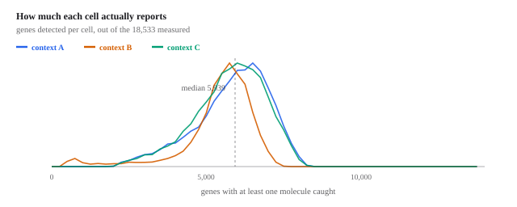
*A typical cell reports about 5,900 of 18,533 genes, and nearly half the transcriptome is effectively silent in any one context.*

A typical cell yields around 20,000 RNA molecules spread across roughly **5,939
distinct genes out of 18,533**. And **47% of genes sit below 5 CPM** in any given
context, with 14% not detected at all. That is not a defect — it is cell identity
again. A skin cell does not run the neuronal program.

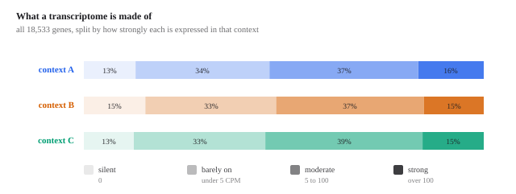
*Half of every transcriptome is silent or barely on — and a gene that is off cannot be knocked down any further.*

It has a blunt consequence for the task: **a gene that is switched off cannot be
knocked down further.** Any predicted change for those genes is noise wearing the
costume of signal.

**Are the three test contexts actually different?**

To see 18,000 dimensions at once you need to project them down. **PCA**
(principal component analysis) finds the directions along which the cells differ
most and plots the first two. It is a rigid rotation of the data, so the
distances you see are real distances — worth saying, because the other embedding
you will meet in this field, [UMAP](https://arxiv.org/abs/1802.03426), preserves
who your neighbours are but not how far apart anything is.

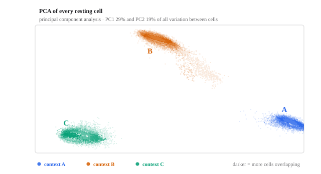
*PCA is a rigid rotation, so these distances are real. A cell's resting state alone is enough to say which context it came from.*

Every one of the 55,200 control cells is plotted. Three tight, well-separated
clouds — the resting cells alone tell you which context they came from, before
any perturbation.

This matters more than it first appears. The resting cells are the *only*
description of the target cell you are given — and they are clearly a rich one,
since they identify the context unambiguously. Everything a model could know
about these cells is in there. The question the challenge poses is whether anyone
can turn that description into a prediction of how the cell will respond, which
is precisely the virtual-cell claim in miniature.

**And how do they differ, gene by gene?**

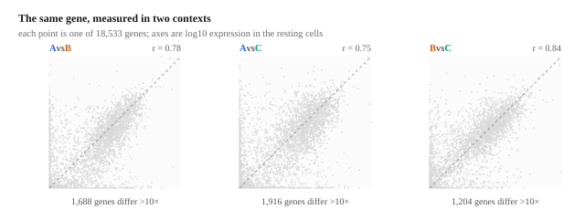
*Aggregate distributions match almost exactly; individual genes do not. That gap is what makes a context a context.*

The aggregate expression distributions of the three contexts are nearly
superimposable — plot the histograms and you would call them replicates. Gene by
gene they correlate at 0.75 to 0.84, and each pair has **over a thousand genes
differing more than tenfold**. Some are fully on in one context and silent in
another.

That gap is what makes a context a context. It is also exactly the thing a model
has to get right.

## So what are A, B and C?

The challenge does not say. The three contexts arrive as anonymous bags of cells,
which is reasonable — the point is to predict, not to look the answer up. But the
resting profiles are informative enough to separate the contexts cleanly, so a
natural question is whether they are informative enough to *name* them.

Worth stating up front: these are the **validation** cell lines, used for the
public leaderboard. The final entry is scored on three *different* held-out lines
whose control profiles are released later — the
[official rules](https://virtualcellchallenge.org/rules) set out the split, and
they also permit published experimental data as *training* material while
forbidding it as an answer, which is what makes the analysis below fair game
rather than an exploit. So this is an analysis of what the
practice problem is made of, not a way to see the exam.

**The data.** [DepMap](https://depmap.org/portal/) publishes bulk RNA-seq for over
1,600 human cancer cell lines — the
[standard reference atlas](https://doi.org/10.1038/s41586-019-1186-3) for this kind
of question. The profiles used here are from the
[24Q4 public release](https://doi.org/10.25452/figshare.plus.27993248). Each
context gives us tens of thousands of unperturbed cells, which sum into a
pseudobulk profile directly comparable in kind.

**The method**, with two adjustments that matter more than the correlation itself.

Single-cell pseudobulk and bulk RNA-seq have different capture biases, so the
absolute similarity between them is not meaningful — only the *ranking* of
candidates is. And every human cell runs the same ribosomal and metabolic
machinery, so a raw correlation is high for every pair and tells you nothing. The
discriminating signal lives in genes that vary *between* cell lines, so the
comparison uses the 3,000 most variable genes in the reference, with each profile
centred on the reference mean before correlating. What is left is the part of a
profile that makes a cell line that particular cell line.

$$
r_i \;=\; \cos\!\big(\, \mathbf{q} - \bar{\mathbf{R}},\;\; \mathbf{R}_i - \bar{\mathbf{R}} \,\big)
$$

$\mathbf{q}$ is the context's profile over the variable genes, $\mathbf{R}_i$
reference line $i$, and $\bar{\mathbf{R}}$ the mean across all reference lines.
Subtracting $\bar{\mathbf{R}}$ from both sides is what removes the shared
housekeeping signal; the candidates are then ranked by $r_i$.

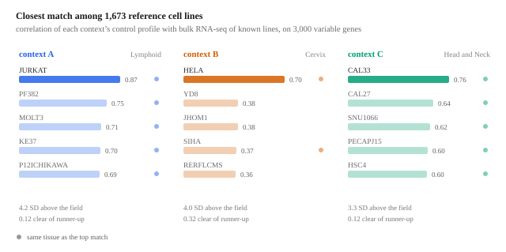
*The top hit is suggestive; the fact that its neighbours share its tissue is what makes it convincing.*

**The results are not subtle.**

Context **A** matches **[Jurkat](https://www.cellosaurus.org/CVCL_0065)**, an
immortalised T-lymphocyte line, at 0.87 — 0.12 clear of the runner-up and more
than four standard deviations above the field. Context **B** matches
**[HeLa](https://www.cellosaurus.org/CVCL_0030)**, the most-used cell line in
biology, by the widest margin of the three: 0.70 against 0.38 for anything else.
Context **C** matches **[CAL33](https://www.cellosaurus.org/CVCL_1108)**, a
head-and-neck squamous carcinoma line, at 0.76.

The single best hit is suggestive; the company it keeps is what makes it
convincing. Every one of A's top five is a lymphoid line. Every one of C's top
five is head-and-neck. B's runner-up field is more mixed, but its winning margin
is more than twice anyone else's. The evidence is not "this one line correlates
slightly better" — it is "this whole neighbourhood of the atlas is the right
tissue, and one line in it stands apart."

**Why this is interesting rather than merely satisfying.** It tells you what kind
of transfer problem each context actually is. My six borrowed screens include
three CD4 T-cell states — the same broad lineage as context A — and nothing from
cervix or head-and-neck at all. Given that effects transfer within a lineage at
around 0.3 and across lineages at 0.02, A is a fundamentally easier target than
B or C, and any honest reading of an overall score has to account for two of the
three contexts having no lineage-matched donor in the pool.

It is also a reminder of how much a resting profile gives away. A model that only
uses those cells as a substrate to multiply against — as mine does — is leaving
identifiable, structured information on the table.

## Borrowing effects from other cell types

With no perturbation data in the target contexts, the only option is to borrow.
Public Perturb-seq datasets exist for several human cell lines, so you can
measure what each knockdown did *there* and carry it over.

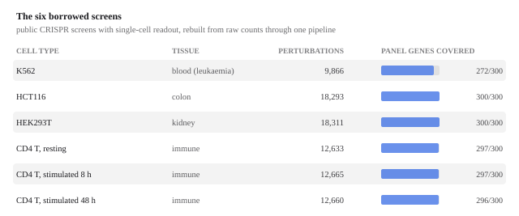
*Coverage is not the problem: 269 of the 300 panel genes were perturbed in all six screens.*

Six screens, spanning blood, colon, kidney and immune cells — the last of these
in three activation states, which turns out to matter. They are the genome-scale
K562 screen of [Replogle et al.](https://doi.org/10.1016/j.cell.2022.05.013), the
HCT116 and HEK293T screens of
[X-Atlas/Orion](https://doi.org/10.1101/2025.06.11.659105), and the resting and
stimulated CD4 T-cell screens of
[Zhu et al.](https://doi.org/10.1016/j.cell.2026.08.002). I rebuilt every one
from
raw counts through a single pipeline rather than using the authors' published
fold changes. That sounds fussy and is not: different papers use different
normalisations, pseudocounts and definitions of "control", so mixing published
effect sizes silently mixes estimators and every downstream comparison inherits
the confusion.

Coverage is not the bottleneck. **269 of the 300 panel genes were perturbed in
all six screens.**

What you carry over is the **log fold change**: for each knockdown, how much each
gene moved relative to untouched control cells, on a log scale so that "doubled"
and "halved" are equal and opposite.

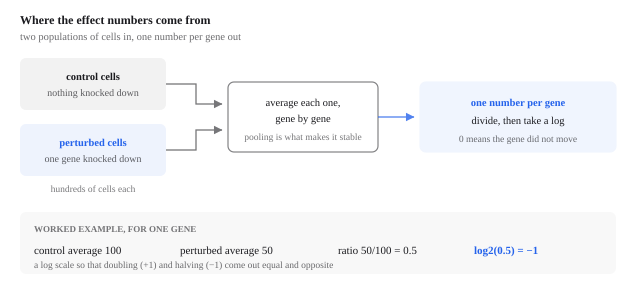
*Repeat for all 18,533 genes for one row, and for all 300 perturbations for the whole table. That table is the entire model.*

$$
e_{pg} \;=\; \log_2 \frac{\bar{x}^{\,\mathrm{pert}}_{pg} + \varepsilon}
                            {\bar{x}^{\,\mathrm{ctrl}}_{g} + \varepsilon}
$$

$\bar{x}^{\,\mathrm{pert}}_{pg}$ is the average of gene $g$ across cells where
$p$ was knocked down, $\bar{x}^{\,\mathrm{ctrl}}_{g}$ the same in untouched
cells, and $\varepsilon$ a small constant so that a gene absent from one side
does not send the ratio to infinity. Base 2 means $+1$ is a doubling and $-1$ a
halving.

Stack those numbers into a table with one row per perturbation and one column per
gene. I will call it the **effect table**.

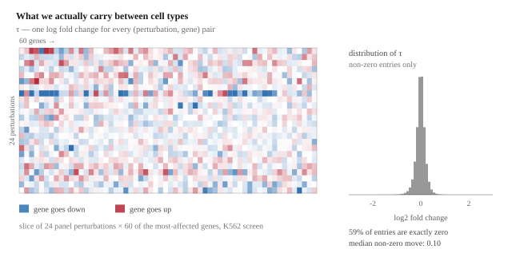
*Most of the table is zero or tiny — the signal is a thin scatter of genes that genuinely move.*

Two things stand out. **59% of its entries are exactly zero**, because the gene
was not expressed in that screen and could not move. And the median non-zero
change is **0.10 on a log2 scale** — about a 7% shift. The heatmap shows the
texture: mostly near-nothing, with occasional rows where a perturbation moves
many genes at once, and a thin scatter of real effects everywhere else.

That table is the object we are betting on. So the obvious question is whether it
survives a change of cell type.

## The number that makes this hard

We can test that directly. Take two screens, find the perturbations they both
measured, and ask how similar their effect vectors are.

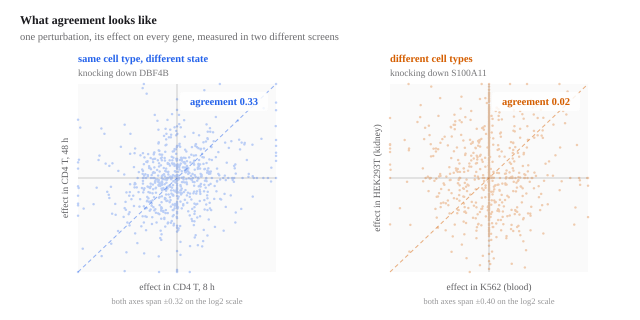
*Left: a gene pushed up in one screen tends to go up in the other. Right: a round cloud — knowing the effect in one cell type tells you almost nothing about the other.*

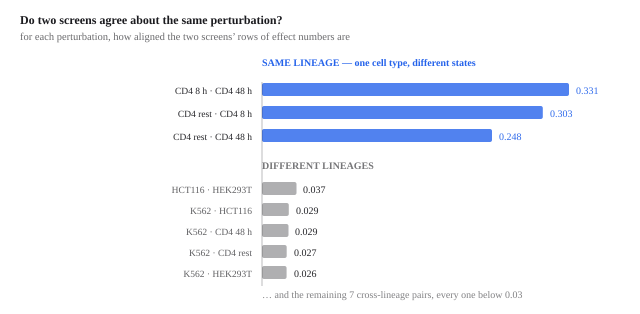
*A tenfold drop the moment you cross cell types. This one number is the whole difficulty of the task.*

**Same lineage, different state** — CD4 T cells resting versus stimulated for
8 or 48 hours — agree at **0.25 to 0.33**. Not high, but clearly real.

**Different lineages** agree at **0.016 to 0.037**. Every single cross-lineage
pair. That is a **tenfold collapse** the moment you cross cell types.

This one measurement is the whole difficulty of the challenge. Knocking out a
gene in a blood cell and in a kidney cell produces effects that are, in direction,
almost unrelated. The shared, generic part of a stress response transfers fine.
The part that is specific to *which gene you hit* barely transfers at all — and
that specific part is exactly what the scoring rewards, because it is what
distinguishes one perturbation from another.

It also explains the benchmark results: if the transferable signal is this thin,
a large model has very little to be large about.

## Building the prediction — and what it sidesteps

Given the effect table, there is still a decision to make, and it is the most
consequential one in the whole pipeline.

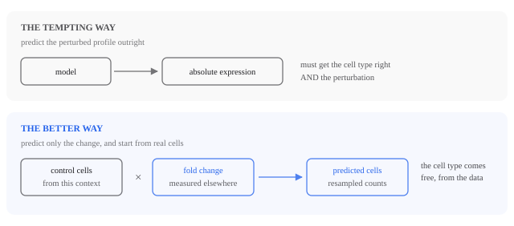
*Which genes are on, at what level, and how much cells vary — all of it arrives with the target's own control cells.*

The tempting move is to have a model output the perturbed cell's expression
directly. The better move is to predict only the *change*, and apply it to real
resting cells drawn from the target context.

Why: those control cells already encode everything context-specific, for free.
Which genes are on, at what level, with how much cell-to-cell variation. You do
not have to model any of it, and you cannot get it wrong. All that remains is the
narrower question of how much each gene moves.

It is worth being blunt about what this manoeuvre is. **It is not a model of the
cell.** It is a way of not needing one. The target cell's state is not
represented, learned or reasoned about — it is *borrowed wholesale*, by starting
from its own cells and only ever predicting a change on top of them. The change
itself comes from measurements in other cell types, unmodified.

That is why it works so well so quickly, and it is also the ceiling built into
it. Every cell-type-specific thing the prediction gets right, it gets right by
copying rather than by understanding, and copying cannot tell you how *this* cell
will respond differently from the ones you copied from.

Put together, the pipeline is two steps:

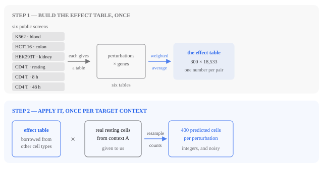
*Step one never sees the target contexts. Step two runs once per context, and everything specific to that context arrives with its own cells.*

Step one happens once and knows nothing about the target contexts. Step two runs
per context and is where the target's own biology enters. The effect table is the model;
everything else is bookkeeping.

## First attempts, and what they teach

It is worth being concrete about the early, bad versions, because each failure
points at something the working version depends on.

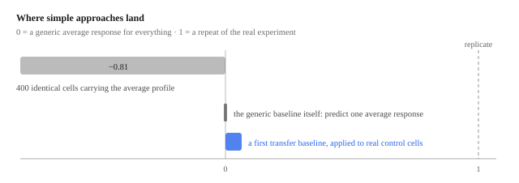
*The naive submission is not merely weak — it is far worse than saying nothing, because several scoring components run tests that need variation between cells.*

**Predict one average response for everything.** This is the scoring rule's zero
point, so it scores 0 by construction. It is a real strategy, though: if
perturbation effects were mostly a shared stress response, it would be hard to
beat — and it is the baseline the benchmark papers found foundation models
struggling to exceed.

**Predict 400 identical cells carrying the correct average profile.** This feels
*more* accurate than the previous idea and scores dramatically worse: about
**−0.81**, far below doing nothing. Several scoring components run statistical
tests for differential expression, comparing perturbed cells against controls.
Those tests need cell-to-cell variation. Give them 400 copies of one profile and
the variance is zero, the tests degenerate, and the components collapse. This is
the dropout lesson from earlier arriving with a bill attached: **you are
submitting a population, and its spread is part of the prediction.**

**Apply one other cell line's measured effects.** This clears zero, modestly, and
was enough for rank 167. A weak model, but it establishes the thing everything
else depends on: perturbation effects do partially transfer.

Combining all six screens and being careful about how the simulated cells are
generated took it from **rank 167 to 58, and then to 45**. I will stop short of
the specifics of the better-performing versions — the competition is still
running, and writing those up in detail is not really in the spirit of it.

## How submissions are scored

You submit simulated cells: 400 for every (context, perturbation) pair, which
comes to 360,000 cells by 18,533 genes. Six components are computed and averaged
by the challenge's [`cell-eval`](https://github.com/ArcInstitute/cell-eval) scorer.
They are worth going through properly, because they do not measure the same thing
and a change that helps one routinely hurts another.

**The common scale.** Every component starts as a raw quantity `u`, which is then
rescaled against a **baseline** `b` — the score of a generic average response —
and an **anchor**, the score of a perfect prediction. For the components where
lower is better and perfect is zero:

$$
s \;=\; 1 - \frac{u}{b}
$$

and for those where higher is better and perfect is one,
$s = (u - b)\,/\,(1 - b)$.
So **0 means "no better than predicting one average response for everything"** and
**1 means "as good as repeating the experiment"** — the real cells split in half,
one half scored against the other. That upper anchor is the honest one: reaching
it means being as close to the truth as the biology is to itself.

Notation, once. For perturbation $p$, write $\mathbf{d}_p$ for the predicted
change and $\boldsymbol{\Delta}_p$ for the true one — both vectors over the
18,533 genes. $b$ is the baseline value of whichever raw quantity is under
discussion.

### 1. Perturbation discrimination — did you predict *this* perturbation?

For each perturbation, compare your predicted change to the true change of **all
300** perturbations, and see where the right one ranks:

$$
u_p \;=\; 1 - \frac{\operatorname{rank}_p}{D}
\qquad\text{where}\qquad
\operatorname{rank}_p = \big|\{\, q : d_{\cos}(\mathbf{d}_p, \boldsymbol{\Delta}_q) < d_{\cos}(\mathbf{d}_p, \boldsymbol{\Delta}_p) \,\}\big|
$$

$\operatorname{rank}_p$ counts how many *wrong* answers your prediction resembles
more than the right one, using cosine distance

$$
d_{\cos}(\mathbf{u}, \mathbf{v}) \;=\; 1 - \frac{\mathbf{u}\cdot\mathbf{v}}{\lVert\mathbf{u}\rVert\,\lVert\mathbf{v}\rVert}.
$$

Get it first and you score 1; land in the middle and you score 0.5, which is
chance.

This is a *retrieval* metric, not an accuracy metric. It does not ask whether your
prediction is close to the truth — it asks whether it is closer to the right truth
than to the 299 wrong ones. And because the distance is a **cosine**, it is
completely blind to magnitude: scaling every prediction by ten changes nothing.

### 2. Expression accuracy — is the predicted profile close?

$$
u \;=\; \frac{\sum_p \big\lVert \mathbf{d}_p - \boldsymbol{\Delta}_p \big\rVert^2}
              {\sum_p \big\lVert \boldsymbol{\Delta}_p \big\rVert^2}
$$

Squared error between predicted and true change, divided by how large the true
change was, summed over perturbations. Unlike discrimination this sees magnitude:
a prediction pointing the right way but twice too far is penalised.

### 3. Fold-change accuracy — are the sizes right?

Restricted to genes that genuinely changed in the real data:

$$
u_p \;=\; \frac{\sum_{g \in G_p} \big| \ell^{\,\mathrm{pred}}_{pg} - \ell^{\,\mathrm{real}}_{pg} \big|}
                {\sum_{g \in G_p} \big| \ell^{\,\mathrm{real}}_{pg} \big|}
$$

with $\ell$ the log fold change and $G_p$ the genes that genuinely changed.

The name says magnitude, but the absolute difference makes this a direction
metric too, and sharply so. Take one gene and read off its contribution to the
numerator, in units of $|\ell^{\,\mathrm{real}}|$:

| your prediction | cost |
|---|---|
| correct, right size | $0$ |
| nothing ($\ell^{\,\mathrm{pred}} = 0$) | $1$ |
| right size, **wrong sign** | $2$ |

So a sign error costs exactly as much *more* than staying silent as a correct
call saves. Direction is first-order here, not a secondary consideration — get it
backwards and you would have been better off predicting no change at all.

That middle row is also the reason this component has a hard floor: **predict
nothing everywhere and the numerator becomes the denominator**, landing you
exactly on the reference point. Predicting zero is not free — you forfeit
everything else — but it is a floor this component alone cannot push you below.

### 4. Direction fidelity — right genes, right way?

$$
u_p \;=\; \frac{k_p}{\max\!\big(n^{\mathrm{pred}}_p,\; n^{\mathrm{conf}}_p\big)}
$$

`k` counts genes you flagged as changed whose direction matches the reference,
`n_pred` is how many you flagged, `n_conf` how many the reference is confident
about. The `max` in the denominator is the interesting part: flag too few and
`n_conf` dominates, flag too many and `n_pred` does. Both are punished, so you
cannot game it by calling everything or nothing.

### 5. Direction reach — how deep does your ranking stay right?

Rank your predicted changes by confidence and walk down the list, tracking the
running fraction whose direction is correct. Let `k*` be the deepest point where
that fraction is still at least 0.9:

$$
k^{*}_p \;=\; \max\big\{\, k \;:\; P_p(k) \ge 0.9 \,\big\},
\qquad
u_p \;=\; \frac{k^{*}_p}{n^{\mathrm{conf}}_p}
$$

where $P_p(k)$ is the fraction of your top-$k$ predicted genes whose direction is
correct.

Fidelity asks whether your calls are right. Reach asks how far down your ordering
survives before it stops being right — it rewards a well-ordered prediction, not
just an accurate one.

### 6. Significance overlap — did you flag the same genes?

$$
u_p \;=\; \frac{\lvert R_p \cap P_p \rvert}{\lvert R_p \cup P_p \rvert}
$$

`R` is the set of genes significantly changed in the real data, `P` the set in
your prediction, with the knocked-down gene itself excluded from both — reporting
that the gene you switched off went down is the premise of the experiment, not a
prediction. This is a plain Jaccard index: of all genes either side flagged, what
fraction did both.

### What this means in practice

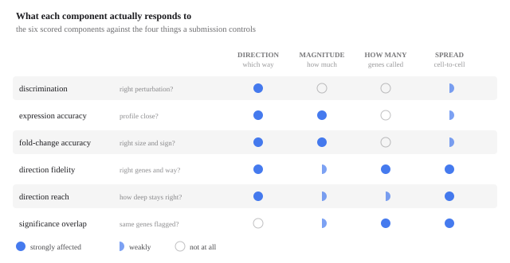
*Discrimination is blind to magnitude. Fold-change accuracy responds strongly to both, since a sign error costs double what silence does. The three differential-expression components all need cell-to-cell spread.*

Reading that grid tells you why the task resists easy wins.

**Discrimination cannot see magnitude at all**, because a cosine is
scale-invariant. Fold-change accuracy sees both, strongly — direction through the
doubled cost of a sign error, magnitude directly.

That combination is what makes the trade-off subtle rather than obvious. Direction
and magnitude are not opposed *in the metrics*; improving direction genuinely helps
both components. The trouble is that the operations available to me for sharpening
direction — reweighting genes, recombining screens, decorrelating predictions —
almost all disturb magnitude as a side effect, and fold-change accuracy charges
for that immediately. Several quite different ideas landed on nearly the same
overall score for exactly this reason: whatever direction they bought was handed
back through the magnitudes they disturbed. The useful question turned out to be
not "which component can I push?" but "is the underlying prediction actually more
accurate?" — because only that moves several at once without a bill attached.

The right-hand column explains the identical-cells disaster from earlier. The
three differential-expression components all depend on statistical tests
comparing your perturbed cells against controls, and those tests need
**cell-to-cell variation**. Emit 400 copies of one profile and the variance is
zero, the tests degenerate, and half the scoreboard collapses — which is how a
submission can land far below simply doing nothing.

## Why it stays hard

Measurement noise is larger than intuition suggests. In a
[2026 Perturb-seq dataset](https://doi.org/10.6084/m9.figshare.33273600) spanning
16 cell lines, each gene was targeted by two independent guide RNAs in the same
line. Those are two measurements of the same
biological thing, and they agree only modestly — not far above the agreement
between *different* cell lines. Since predictions are scored against one noisy
measurement, some of the apparent error is irreducible, and some of what looks
like poor transfer is the noise floor of the assay showing through.

But the deeper reason is the one from the previous section, and the donor
agreement figure is where it becomes concrete. Effects transfer between cell
types at a cosine of about **0.02**. A method built on copying measured effects
is therefore working with a channel that is almost closed — and no amount of
care in *how* you copy will widen it, because the information simply is not in
the source.

What would widen it is a model that represents the target cell and derives the
response from that representation, rather than importing a response measured
somewhere else. That is the virtual-cell claim — Arc's own
[State](https://doi.org/10.1016/j.cell.2026.07.052) model is an attempt at exactly
that — and this challenge is a fair test of it precisely because it withholds
every opportunity to substitute recall for understanding.

## Conclusion and future work

The 2026 challenge is a much cleaner test than the 2025 one. Withholding
perturbation data entirely for the scored cell types stops rewarding models that
memorise one cell type and forces the real question: has anything general been
learned about how genes regulate each other?

My own results say a careful, simple approach gets surprisingly far; that the
largest early gains came from respecting the structure of the data rather than
from model capacity; and that the remaining gap is not obviously closed by
building something bigger. The tenfold drop in cross-lineage agreement is,
I think, the single most important number for anyone starting on this.

Where I would take it next:

- **Understand the noise floor before chasing accuracy.** If two guides against
  the same gene in the same cell line agree only moderately, the ceiling on any
  predictor is lower than the metric implies, and the right target may be the
  reproducible part of the response rather than the measurement.
- **Turn the resting state into a model, not just a starting point.** The
  embeddings show the control cells identify their context unambiguously, so the
  information is there. Using it only as a substrate to multiply against is the
  shortcut; learning how that state *modulates* a response is the actual problem,
  and the one worth failing at.
- **Treat public perturbation data as one dataset, not many.** Rebuilding
  everything from raw counts through a single pipeline is unglamorous and repaid
  itself immediately.
- **Design for the population, not the average.** The identical-cells failure is
  the clearest lesson of the exercise: the distribution you emit is part of the
  prediction, not a presentation detail.

## References

Everything above that is not measured from the challenge data is drawn from
these. Links in the body point into this list.

**The challenge**

- Roohani, Y.H. *et al.* [Virtual Cell Challenge: toward a Turing test for the virtual cell](https://doi.org/10.1016/j.cell.2025.06.008). *Cell* **188**, 3370–3374 (2025).
- Adduri, A. *et al.* [Virtual Cell Challenge 2026: benchmarking zero-shot generalization across cellular contexts](https://doi.org/10.1016/j.cell.2026.08.004). *Cell* (2026).
- Arc Institute. [Official rules](https://virtualcellchallenge.org/rules) and [2026 announcement](https://arcinstitute.org/news/virtual-cell-challenge-2026).
- Arc Institute. [`cell-eval`](https://github.com/ArcInstitute/cell-eval) — the scorer the six components come from.
- Adduri, A.K. *et al.* [Predicting cellular responses to perturbation across diverse contexts with State](https://doi.org/10.1016/j.cell.2026.07.052). *Cell* (2026).

**Measuring cells, and switching genes off**

- Qi, L.S. *et al.* [Repurposing CRISPR as an RNA-guided platform for sequence-specific control of gene expression](https://doi.org/10.1016/j.cell.2013.02.022). *Cell* **152**, 1173–1183 (2013).
- Gilbert, L.A. *et al.* [Genome-scale CRISPR-mediated control of gene repression and activation](https://doi.org/10.1016/j.cell.2014.09.029). *Cell* **159**, 647–661 (2014).
- Dixit, A. *et al.* [Perturb-seq: dissecting molecular circuits with scalable single-cell RNA profiling of pooled genetic screens](https://doi.org/10.1016/j.cell.2016.11.038). *Cell* **167**, 1853–1866 (2016).
- Adamson, B. *et al.* [A multiplexed single-cell CRISPR screening platform enables systematic dissection of the unfolded protein response](https://doi.org/10.1016/j.cell.2016.11.048). *Cell* **167**, 1867–1882 (2016).
- Svensson, V. [Droplet scRNA-seq is not zero-inflated](https://doi.org/10.1038/s41587-019-0379-5). *Nature Biotechnology* **38**, 147–150 (2020).
- Squair, J.W. *et al.* [Confronting false discoveries in single-cell differential expression](https://doi.org/10.1038/s41467-021-25960-2). *Nature Communications* **12**, 5692 (2021).
- McInnes, L., Healy, J. & Melville, J. [UMAP: uniform manifold approximation and projection for dimension reduction](https://arxiv.org/abs/1802.03426). arXiv:1802.03426 (2018).

**The six borrowed screens, and the noise floor**

- Replogle, J.M. *et al.* [Mapping information-rich genotype–phenotype landscapes with genome-scale Perturb-seq](https://doi.org/10.1016/j.cell.2022.05.013). *Cell* **185**, 2559–2575 (2022). — K562.
- Huang, A.C. *et al.* [X-Atlas/Orion: genome-wide Perturb-seq datasets via a scalable fix-cryopreserve platform](https://doi.org/10.1101/2025.06.11.659105). bioRxiv (2025). — HCT116 and HEK293T.
- Zhu, R. *et al.* [Genome-scale perturb-seq in primary human CD4+ T cells maps context-specific regulators of T cell programs and human immune traits](https://doi.org/10.1016/j.cell.2026.08.002). *Cell* (2026). — CD4 T cells, resting and stimulated.
- Ward, L. [Dissecting context-dependent cancer vulnerabilities using Perturb-seq — data](https://doi.org/10.6084/m9.figshare.33273600). figshare (2026). — the 16-line, two-guide design behind the noise-floor estimate.

**Identifying the contexts**

- Ghandi, M. *et al.* [Next-generation characterization of the Cancer Cell Line Encyclopedia](https://doi.org/10.1038/s41586-019-1186-3). *Nature* **569**, 503–508 (2019).
- DepMap, Broad. [DepMap 24Q4 public](https://doi.org/10.25452/figshare.plus.27993248). Figshare+ (2024). — `OmicsExpressionProteinCodingGenesTPMLogp1`, the reference matrix used here.
- Cellosaurus: [Jurkat, CVCL_0065](https://www.cellosaurus.org/CVCL_0065) · [HeLa, CVCL_0030](https://www.cellosaurus.org/CVCL_0030) · [CAL-33, CVCL_1108](https://www.cellosaurus.org/CVCL_1108).

**What the big models can and cannot do**

- Wei, Z. *et al.* [Benchmarking algorithms for generalizable single-cell perturbation response prediction](https://doi.org/10.1038/s41592-025-02980-0). *Nature Methods* **23**, 451–464 (2025). — scPerturBench.
- Ahlmann-Eltze, C., Huber, W. & Anders, S. [Deep-learning-based gene perturbation effect prediction does not yet outperform simple linear baselines](https://doi.org/10.1038/s41592-025-02772-6). *Nature Methods* **22**, 1657–1661 (2025).
- Cui, H. *et al.* [scGPT: toward building a foundation model for single-cell multi-omics using generative AI](https://doi.org/10.1038/s41592-024-02201-0). *Nature Methods* **21**, 1470–1480 (2024).
- Theodoris, C.V. *et al.* [Transfer learning enables predictions in network biology](https://doi.org/10.1038/s41586-023-06139-9). *Nature* **618**, 616–624 (2023). — Geneformer.
