Suppose you could ask a computer what happens to a cell when you switch off one
particular gene — and trust the answer well enough to skip the experiment. That
is the goal behind the
[Virtual Cell Challenge](https://arcinstitute.org/virtual-cell-initiative), an
annual competition run by the Arc Institute.

I have been working on the 2026 edition. This post is an introduction to the
problem for people who can code but have never touched a pipette, and for
biologists who want to know why this is a hard machine learning problem rather
than a data-cleaning exercise. I define every term as it comes up, and every
number and figure below is measured from the actual challenge data.

## What a cell is actually doing

Start with the thing that surprises most people coming from software: **every
cell in your body contains the same genome.** A liver cell and a neuron carry
identical DNA. What differs is which genes each one is *using*.

A gene is a stretch of DNA that gets copied into RNA, and that RNA is usually
then translated into a protein that does something. **Gene expression** is how
much RNA a cell is currently making from a given gene — think of it as the volume
knob on that gene. The full set of RNA in a cell is its **transcriptome**.

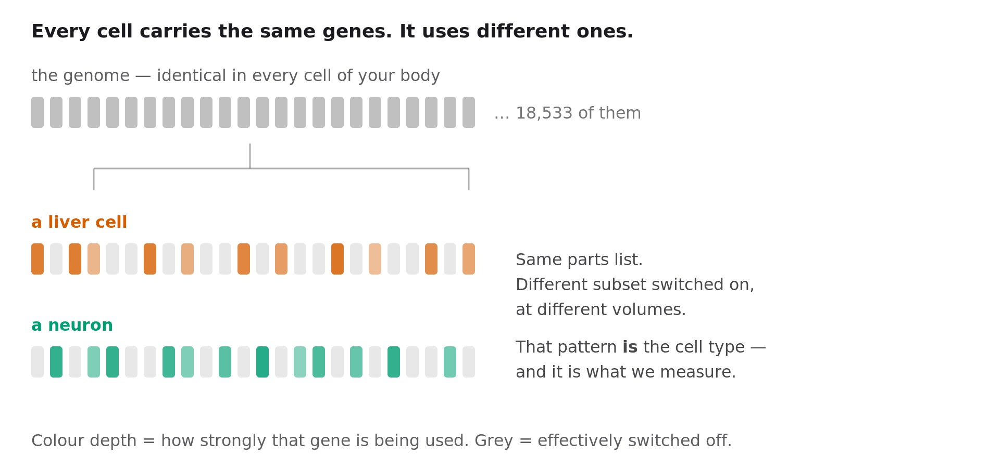
*Cell identity is not a different parts list. It is a different subset of the same list, switched on at different volumes.*

So a cell type is not a different parts list. It is a different *configuration*
of the same parts list. The genome is the code; expression is the running
process. When you hear "cell context" in this field, that is what it means: which
genes are on, and how loudly.

## Reading a cell, one molecule at a time

**Single-cell RNA sequencing** measures that configuration one cell at a time.
You capture thousands of individual cells, attach a molecular barcode unique to
each one, sequence everything together, then use the barcodes to sort the reads
back into per-cell profiles.

What you get is a table.

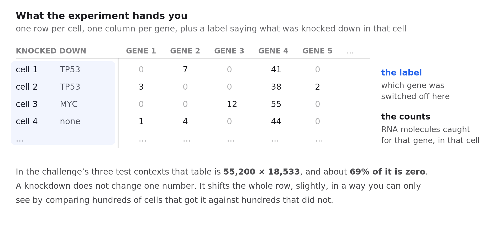
*The measurement is a large, mostly-empty integer table with a perturbation label attached to every row.*

Rows are cells, columns are genes, and each entry counts how many RNA molecules
of that gene were caught in that cell. About **69% of that table is zero**.

Here is the part that trips up everyone modelling this data for the first time.
**A zero does not mean the gene is off.** Sequencing catches only a sample of the
molecules present, so a gene that is genuinely active can easily produce no reads
at all in a given cell. This is called **dropout**, and it is not a rare edge
case:

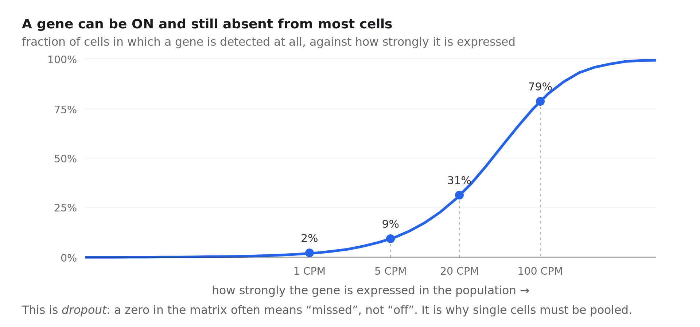
*A zero in the matrix usually means the molecule was missed, not that the gene is off. This is why single cells have to be pooled.*

A gene expressed at 5 counts per million — a real, functioning level — is detected
in under **10%** of cells. Even at 20 CPM it appears in about a third. Only well
above 100 CPM do you see it in most cells.

The consequence shapes everything downstream: **you cannot say much about any
individual cell.** Statements only become reliable when you pool hundreds of
cells that share a condition. That is why every method here works on
*populations*, and why, as we will see, submitting a single "best guess" cell
profile is catastrophically wrong.

## Switching a gene off on purpose

To find out what a gene does, turn it off and watch.

**CRISPR** is the tool. Its familiar form uses a protein called Cas9 which is
guided to a chosen spot in the genome by a short **guide RNA** — a piece of RNA
whose sequence matches the target — where it cuts the DNA. The variant used here
is **CRISPRi**, for CRISPR interference. It uses a Cas9 that has been
deliberately broken so it can no longer cut. It just parks on the gene's control
region and blocks the machinery that reads it.

The gene is not destroyed, it is turned down — typically to 10–30% of normal.
That is a **knockdown** rather than a knockout, and it is closer to real biology,
where genes are usually dialled rather than deleted.

Now combine the two ideas. Put a *different* guide RNA into each cell in a large
pool, so every cell has a different gene knocked down, then sequence all of them
at once. Each cell reports both which gene was targeted in it and what happened
to the other 18,000 genes. That is **Perturb-seq**, and one experiment can survey
hundreds of genes.

Two words you will keep meeting: a **perturbation** is one gene knocked down, and
a **context** is a particular kind of cell. The entire difficulty of this
challenge lives in the interaction between those two.

## What the challenge asks

The [2025 edition](https://arcinstitute.org/virtual-cell-initiative), the first,
released roughly 300,000 H1 human embryonic stem cells carrying 300 genetic
perturbations, split into fine-tuning, validation and test segments. Over 5,000
people registered from 114 countries, more than 1,200 teams submitted, and over
300 made final submissions, competing for a $100,000 grand prize sponsored by
NVIDIA, 10x Genomics and Ultima Genomics. The accompanying paper, *"Virtual Cell
Challenge: Toward a Turing test for the virtual cell"*, appeared in Cell in 2025.

The structural detail that matters: in 2025 you saw the target cell type
perturbed. You had H1 stem cells with many perturbations measured, and predicted
*different* perturbations in *that same cell type*. A model could learn what
responses look like in H1 specifically and fill in gaps — **interpolation**.

2026 removes that.

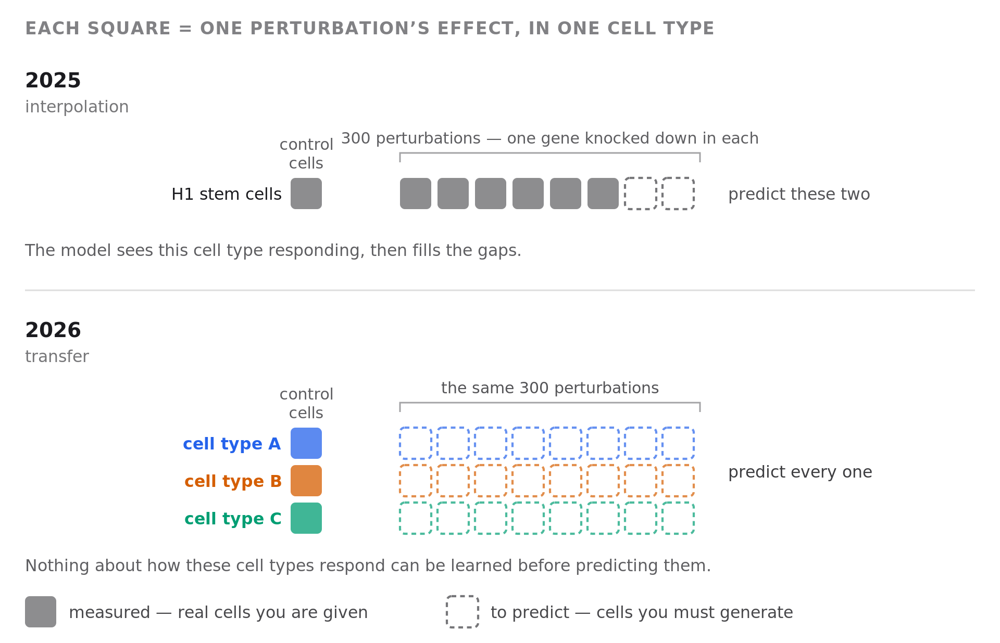
*The 2026 edition removes every measured perturbation in the cell types that will be scored.*

There is no training set. You must predict knockdown responses in cell types you
have never seen perturbed, given only those cells sitting there unperturbed and a
list of genes to knock down. This is **zero-shot** prediction, and it demands
something categorically different: whatever the model knows about perturbations
has to come from *other* cell types and still apply here.

That is a genuinely open problem. Several 2025 benchmarking papers — most
pointedly a *Nature Methods* study called scPerturBench — reported that large
single-cell "foundation models" often fail to beat a trivial baseline that
predicts the same average response for every perturbation, and attributed it to
models not representing cellular context well.

## Looking at the data before modelling anything

Three questions are worth answering before writing a line of model code.

**How much signal is in one cell?**

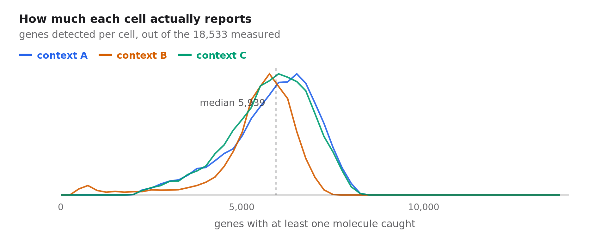
*A typical cell reports about 5,900 of 18,533 genes, and nearly half the transcriptome is effectively silent in any one context.*

A typical cell yields around 20,000 RNA molecules spread across roughly **5,939
distinct genes out of 18,533**. And **47% of genes sit below 5 CPM** in any given
context, with 14% not detected at all. That is not a defect — it is cell identity
again. A skin cell does not run the neuronal program.

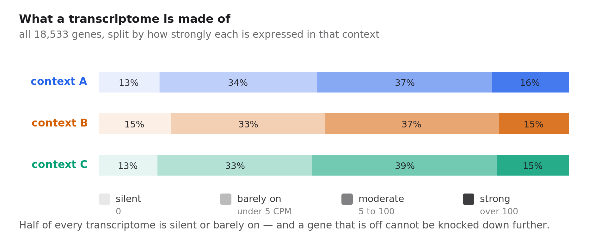
*Half of every transcriptome is silent or barely on, and the split is nearly identical in all three contexts.*

It has a blunt consequence for the task: **a gene that is switched off cannot be
knocked down further.** Any predicted change for those genes is noise wearing the
costume of signal.

**Are the three test contexts actually different?**

To see 18,000 dimensions at once you need to project them down. **PCA**
(principal component analysis) finds the directions along which the cells differ
most and plots the first two. It is a rigid rotation of the data, so the
distances you see are real distances — worth saying, because the other embedding
you will meet in this field, UMAP, preserves who your neighbours are but not how
far apart anything is.

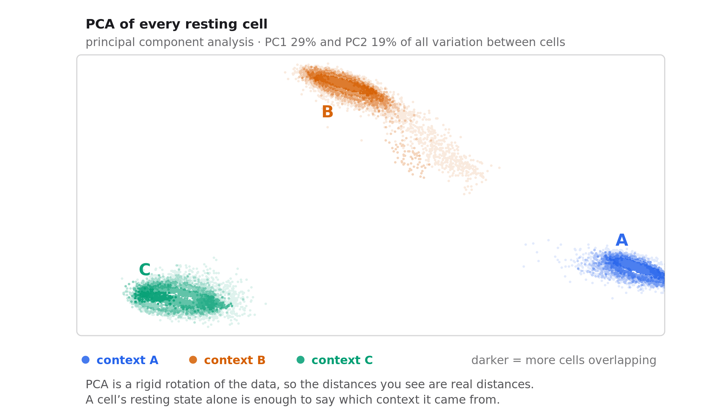
*A cell's resting state alone is enough to say which context it came from.*

Every one of the 55,200 control cells is plotted. Three tight, well-separated
clouds — the resting cells alone tell you which context they came from, before
any perturbation.

This is encouraging and discouraging at once. Encouraging, because the model *is*
told which context it must predict for — that information sits right there in the
control cells. Discouraging, because it confirms these are genuinely different
cell states, so an effect measured in one has no automatic right to apply in
another.

**And how do they differ, gene by gene?**

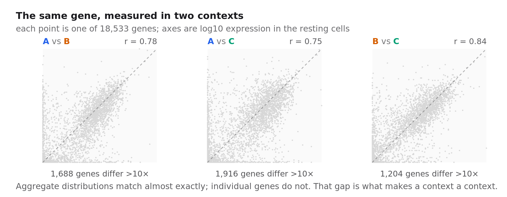
*Aggregate distributions match almost exactly; individual genes do not. That gap is the biology a model has to capture.*

The aggregate expression distributions of the three contexts are nearly
superimposable — plot the histograms and you would call them replicates. Gene by
gene they correlate at 0.75 to 0.84, and each pair has **over a thousand genes
differing more than tenfold**. Some are fully on in one context and silent in
another.

That gap is what makes a context a context. It is also exactly the thing a model
has to get right.


## Borrowing effects from other cell types

With no perturbation data in the target contexts, the only option is to borrow.
Public Perturb-seq datasets exist for several human cell lines, so you can
measure what each knockdown did *there* and carry it over.

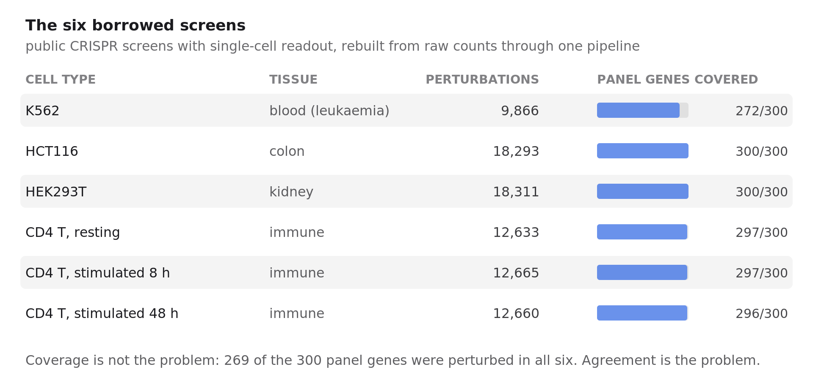
*Six borrowed screens spanning four tissues. Coverage of the panel is nearly complete, so the difficulty lies elsewhere.*

Six screens, spanning blood, colon, kidney and immune cells — the last of these
in three activation states, which turns out to matter. I rebuilt every one from
raw counts through a single pipeline rather than using the authors' published
fold changes. That sounds fussy and is not: different papers use different
normalisations, pseudocounts and definitions of "control", so mixing published
effect sizes silently mixes estimators and every downstream comparison inherits
the confusion.

Coverage is not the bottleneck. **269 of the 300 panel genes were perturbed in
all six screens.**

What you carry over is the **log fold change**: for each knockdown, how much each
gene moved relative to untouched control cells, on a log scale so that "doubled"
and "halved" are equal and opposite.

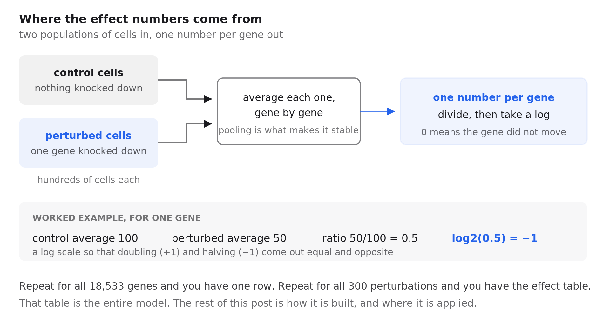
*One number, from two populations of cells. Repeat per gene for a row, and per perturbation for the whole table.*

```python
# One number per (perturbation, gene): how much this gene moves
# when that gene is knocked down. log2, so +1 = doubled, -1 = halved.
effect = np.log2((perturbed_mean + eps) / (control_mean + eps))
```

Stack those numbers into a table with one row per perturbation and one column per
gene. I will call it the **effect table**.

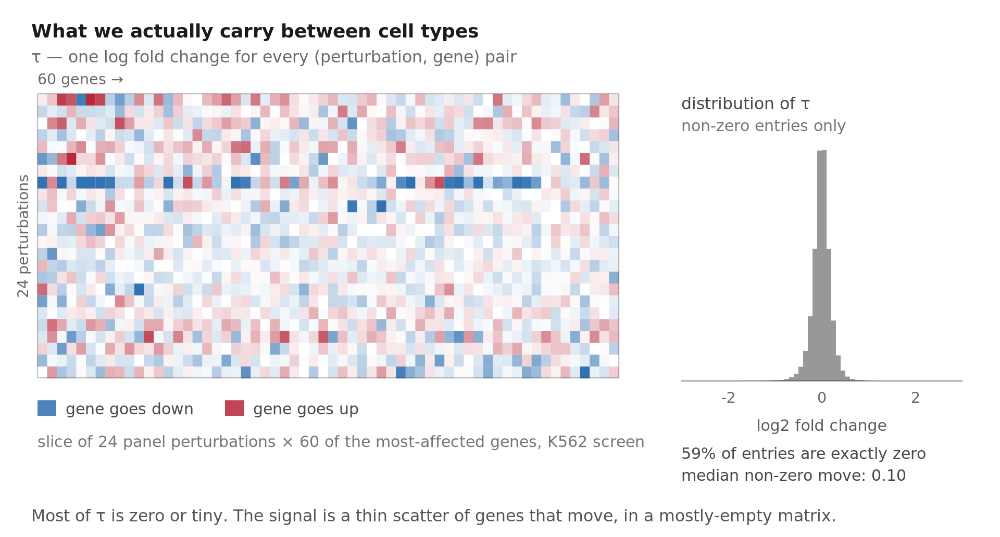
*The effect table is mostly zero or near-zero, with a thin scatter of genes that genuinely move.*

Two things stand out. **59% of its entries are exactly zero**, because the gene
was not expressed in that screen and could not move. And the median non-zero
change is **0.10 on a log2 scale** — about a 7% shift. The heatmap shows the
texture: mostly near-nothing, with occasional rows where a perturbation moves
many genes at once, and a thin scatter of real effects everywhere else.

That table is the object we are betting on. So the obvious question is whether it
survives a change of cell type.

## The number that makes this hard

We can test that directly. Take two screens, find the perturbations they both
measured, and ask how similar their effect vectors are.

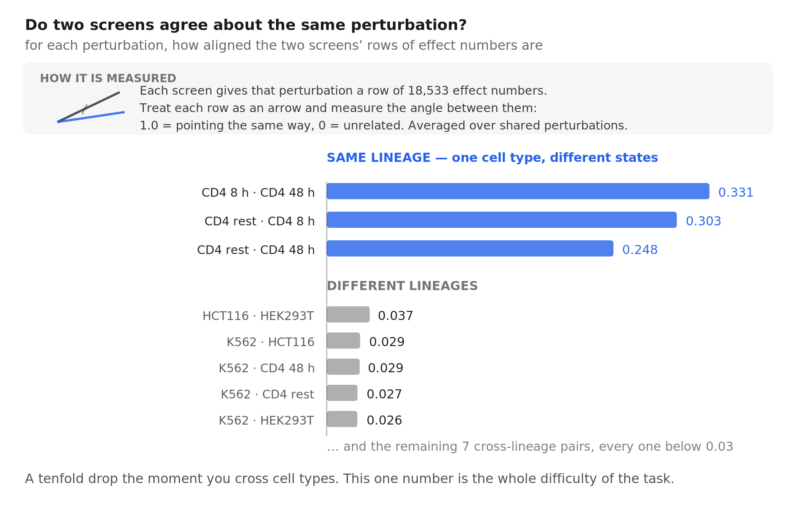
*Cross the cell type and agreement drops roughly tenfold. This is the measurement that defines the difficulty of the task.*

**Same lineage, different state** — CD4 T cells resting versus stimulated for
8 or 48 hours — agree at **0.25 to 0.33**. Not high, but clearly real.

**Different lineages** agree at **0.016 to 0.037**. Every single cross-lineage
pair. That is a **tenfold collapse** the moment you cross cell types.

This one measurement is the whole difficulty of the challenge. Knocking out a
gene in a blood cell and in a kidney cell produces effects that are, in direction,
almost unrelated. The shared, generic part of a stress response transfers fine.
The part that is specific to *which gene you hit* barely transfers at all — and
that specific part is exactly what the scoring rewards, because it is what
distinguishes one perturbation from another.

It also explains the benchmark results: if the transferable signal is this thin,
a large model has very little to be large about.

## Building the prediction

Given the effect table, there is still a decision to make, and it is the most consequential one
in the whole pipeline.

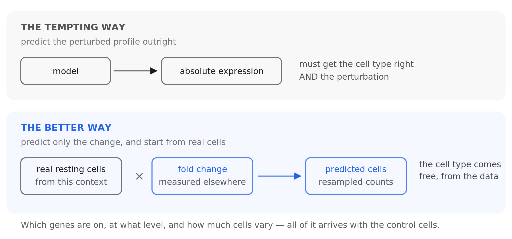
*Predicting only the change lets the target's own control cells supply everything about that cell type, for free.*

The tempting move is to have a model output the perturbed cell's expression
directly. The better move is to predict only the *change*, and apply it to real
resting cells drawn from the target context.

Why: those control cells already encode everything context-specific, for free.
Which genes are on, at what level, with how much cell-to-cell variation. You do
not have to model any of it, and you cannot get it wrong. All that remains is the
narrower question of how much each gene moves.

Put together, the pipeline is two steps:

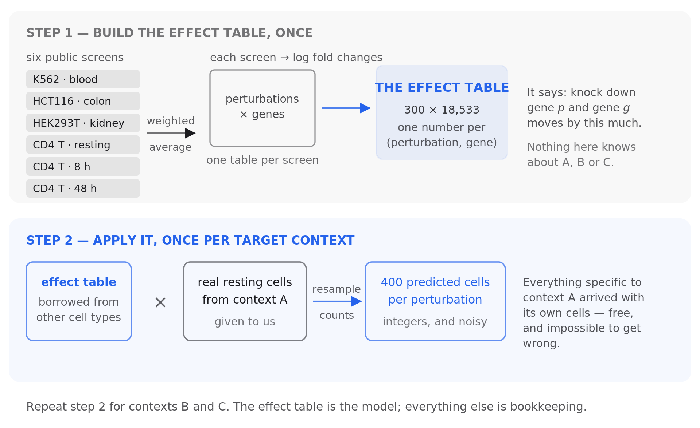
*The whole method in two steps. Step one never sees the target contexts; step two is where their biology enters.*

Step one happens once and knows nothing about the target contexts. Step two runs
per context and is where the target's own biology enters. The effect table is the model;
everything else is bookkeeping.

## First attempts, and what they teach

It is worth being concrete about the early, bad versions, because each failure
points at something the working version depends on.

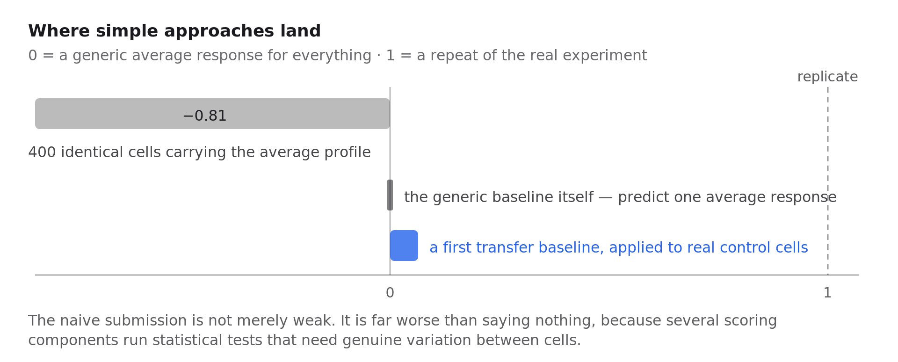
*Submitting 400 identical cells scores far below doing nothing, because the differential-expression tests need variation between cells.*

**Predict one average response for everything.** This is the scoring rule's zero
point, so it scores 0 by construction. It is a real strategy, though: if
perturbation effects were mostly a shared stress response, it would be hard to
beat — and it is the baseline the benchmark papers found foundation models
struggling to exceed.

**Predict 400 identical cells carrying the correct average profile.** This feels
*more* accurate than the previous idea and scores dramatically worse: about
**−0.81**, far below doing nothing. Several scoring components run statistical
tests for differential expression, comparing perturbed cells against controls.
Those tests need cell-to-cell variation. Give them 400 copies of one profile and
the variance is zero, the tests degenerate, and the components collapse. This is
the dropout lesson from earlier arriving with a bill attached: **you are
submitting a population, and its spread is part of the prediction.**

**Apply one other cell line's measured effects.** This clears zero, modestly, and
was enough for rank 167. A weak model, but it establishes the thing everything
else depends on: perturbation effects do partially transfer.

Combining all six screens and being careful about how the simulated cells are
generated took it from **rank 167 to 58, and then to 45**. I will stop short of
the specifics of the better-performing versions — the competition is still
running, and writing those up in detail is not really in the spirit of it.

## How submissions are scored

You submit simulated cells: 400 for every (context, perturbation) pair, which
comes to 360,000 cells by 18,533 genes. The components ask different questions:

- Can you tell the perturbations apart from one another?
- Are the predicted expression levels close in absolute terms?
- Are the magnitudes of change right?
- Do genes move in the correct direction?
- Do you flag the same genes as significantly changed?

Each is rescaled so **0 means "no better than a generic average response"** and
**1 means "as good as a repeat of the experiment"** — the real cells split in
half, one half scored against the other. That upper anchor is the honest one:
reaching it means being as close to the truth as the biology is to itself.

Reading the scoring code rather than its summary was among the most useful things
I did. It turns a vague goal into specific, checkable targets, and it revealed
that the components trade against each other in ways that are not obvious from
the descriptions.

## Why it stays hard

Two things stand out after a few weeks.

The components pull against each other. Sharpen your ability to distinguish
perturbations and you tend to lose accuracy on the magnitudes; fix the magnitudes
and the distinctions blur. Several quite different ideas I tried landed on nearly
the same total by trading one for the other. That is what happens when the
underlying prediction is not yet good enough — you slide along a trade-off curve
instead of stepping off it.

And measurement noise is larger than intuition suggests. In a published 2026
Perturb-seq study spanning 16 cell lines, each gene was targeted by two
independent guide RNAs in the same line. Those are two measurements of the same
biological thing, and they agree only modestly — not far above the agreement
between *different* cell lines. Since predictions are scored against one noisy
measurement, some of the apparent error is irreducible, and some of what looks
like poor transfer is the noise floor of the assay showing through.

## Conclusion and future work

The 2026 challenge is a much cleaner test than the 2025 one. Withholding
perturbation data entirely for the scored cell types stops rewarding models that
memorise one cell type and forces the real question: has anything general been
learned about how genes regulate each other?

My own results say a careful, simple approach gets surprisingly far; that the
largest early gains came from respecting the structure of the data rather than
from model capacity; and that the remaining gap is not obviously closed by
building something bigger. The tenfold drop in cross-lineage agreement is,
I think, the single most important number for anyone starting on this.

Where I would take it next:

- **Understand the noise floor before chasing accuracy.** If two guides against
  the same gene in the same cell line agree only moderately, the ceiling on any
  predictor is lower than the metric implies, and the right target may be the
  reproducible part of the response rather than the measurement.
- **Use the resting state more aggressively.** The embeddings show control cells
  identify their context unambiguously. Turning that identity into a prediction of
  *how strongly* each gene will respond is the open question.
- **Treat public perturbation data as one dataset, not many.** Rebuilding
  everything from raw counts through a single pipeline is unglamorous and repaid
  itself immediately.
- **Design for the population, not the average.** The identical-cells failure is
  the clearest lesson of the exercise: the distribution you emit is part of the
  prediction, not a presentation detail.
